# ProjetGit Groupe 3

## Membres de l'equipe

- Alberto Meléndez García
- Adrien Perdoux
- Enzo Poitiers 
- Aiman Gamine Khiyati
- Enzo Garcia

### Index.html

### Page Alberto Meléndez García 

Ci dessus les photos de ma page HTML:

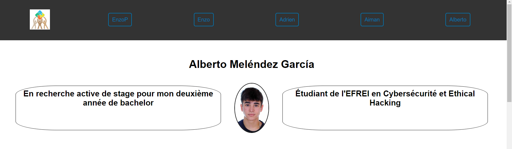

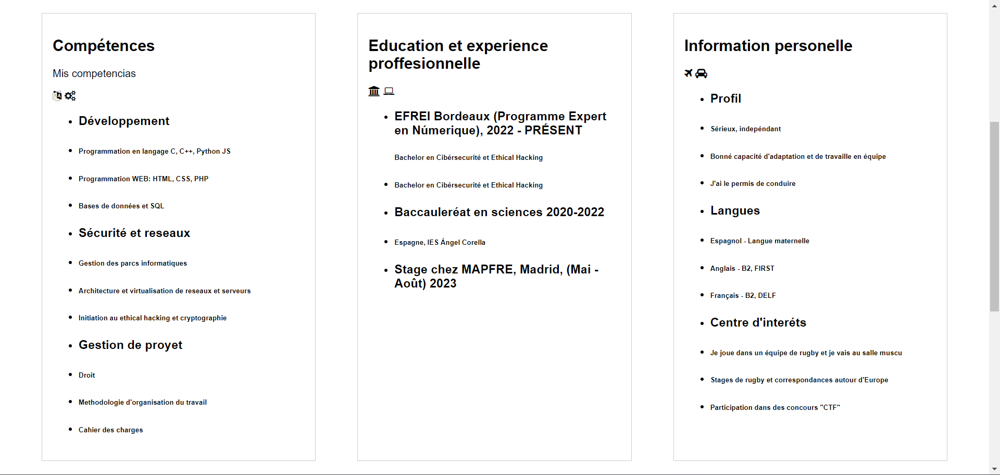

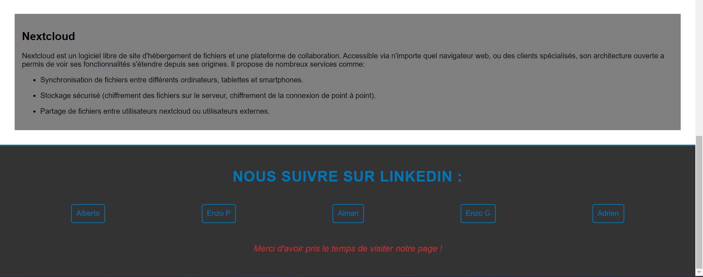

Moi j'ai choisi Nextcloud: Est une plateforme de stockage open source qui permets de stocker, synchroniser et partager fichiers. Sur Nexcloud c'est possible d'avoir une propre instance de serveur, ce qui signifie un contrôle total sur les données et sur la confidentialité.

C'est possible d'installer Nextcloud sur un serveur propre ou utiliser des fournisseurs qui proposent des services Nextcloud.
En plus des fonctionnalités standard de stockage en nuage, Nextcloud met également l'accent sur la sécurité et la confidentialité en fournissant des options de chiffrement et d'authentification à deux facteurs.

C'est une alternative auto-gérée aux services de stockage en nuage plus importants pour ce qui valorisent la confidentialité. 

### Page Adrien Perdoux

Ci dessus les photos de ma page HTML:

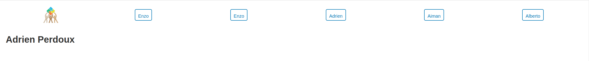

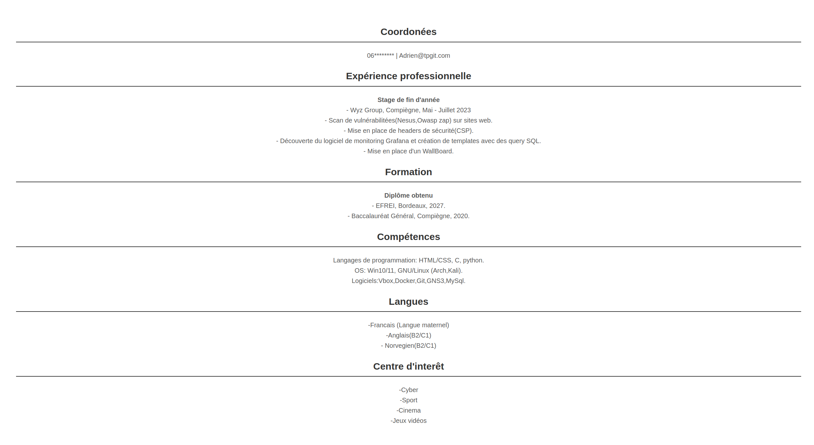

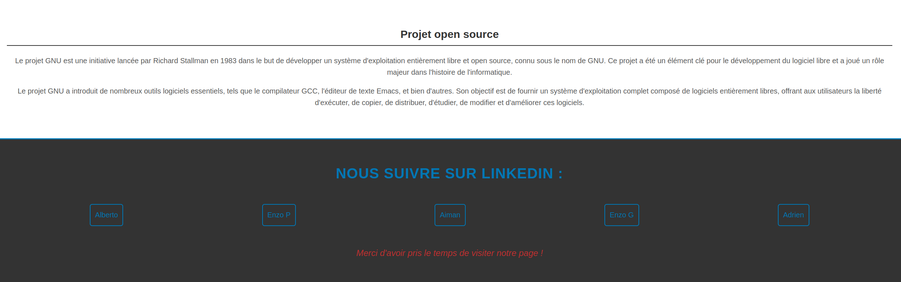

### Page GAMINE KHIYATI Aiman

Ci dessus les photos de ma page HTML:

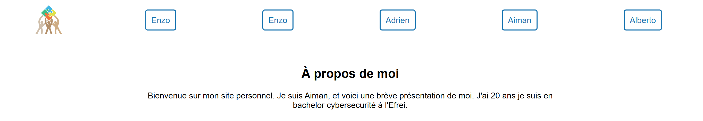

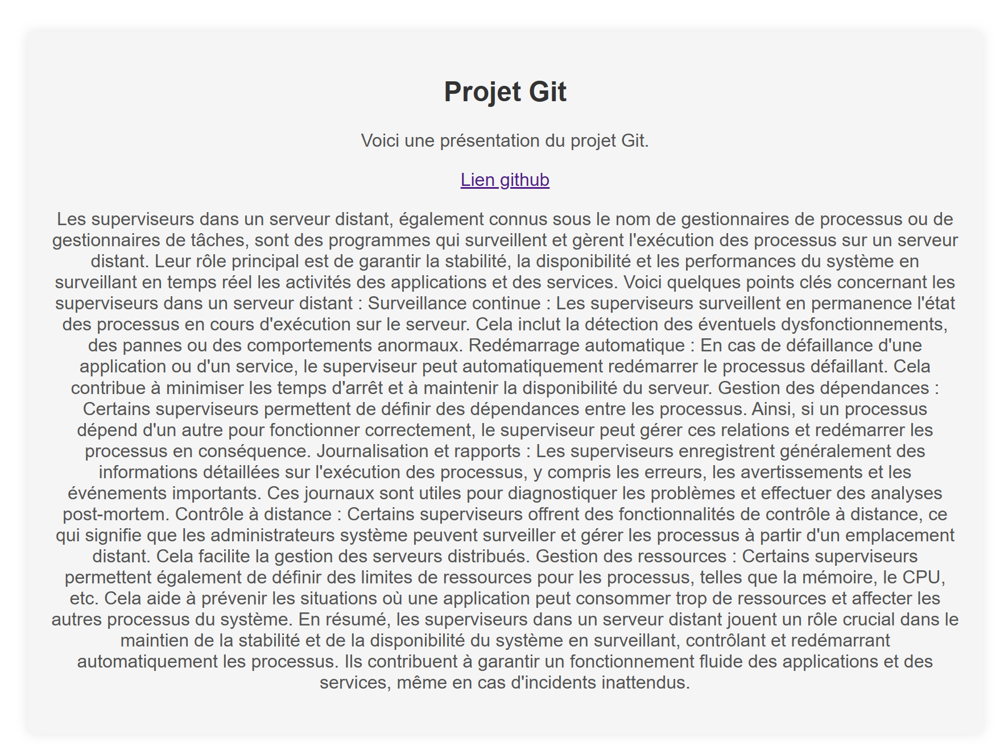

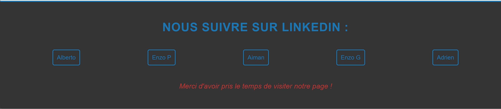

### Enzo Poitiers

- Veuillez trouver ci-joint, les photos de ma page HTML :

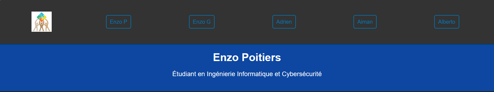

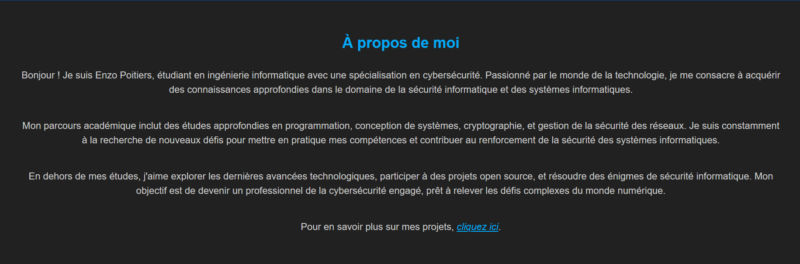

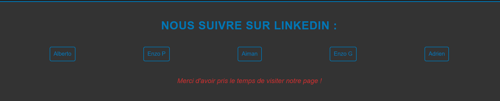

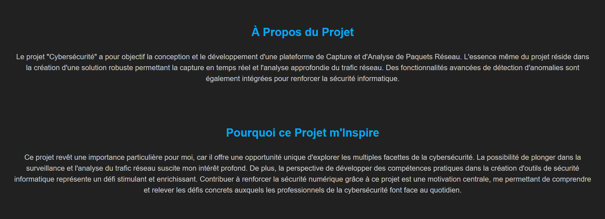

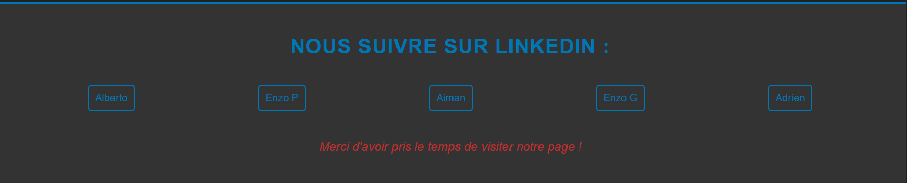

- La Plateforme de Capture et d'Analyse de Paquets Réseau est un projet visant à développer un système capable de surveiller et analyser le trafic réseau en temps réel. Les fonctionnalités clés incluent la capture de paquets, le stockage de ces données pour une analyse ultérieure, l'analyse en temps réel pour détecter les anomalies ou les attaques, le filtrage et le requêtage pour extraire des informations spécifiques, ainsi que la présentation visuelle des résultats à travers des graphiques ou des tableaux de bord. Ce type de plateforme est essentiel pour la gestion efficace des réseaux, la détection d'incidents de sécurité, le dépannage et l'optimisation des performances.